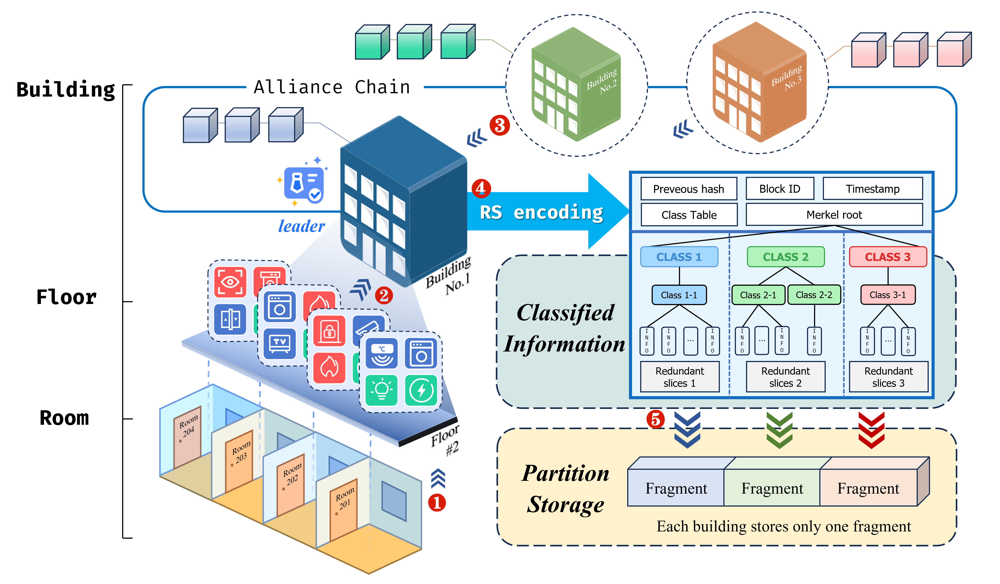
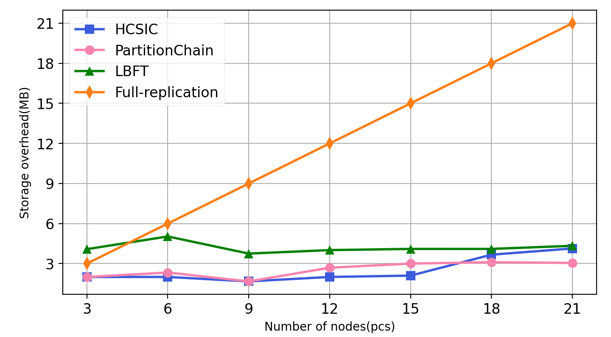
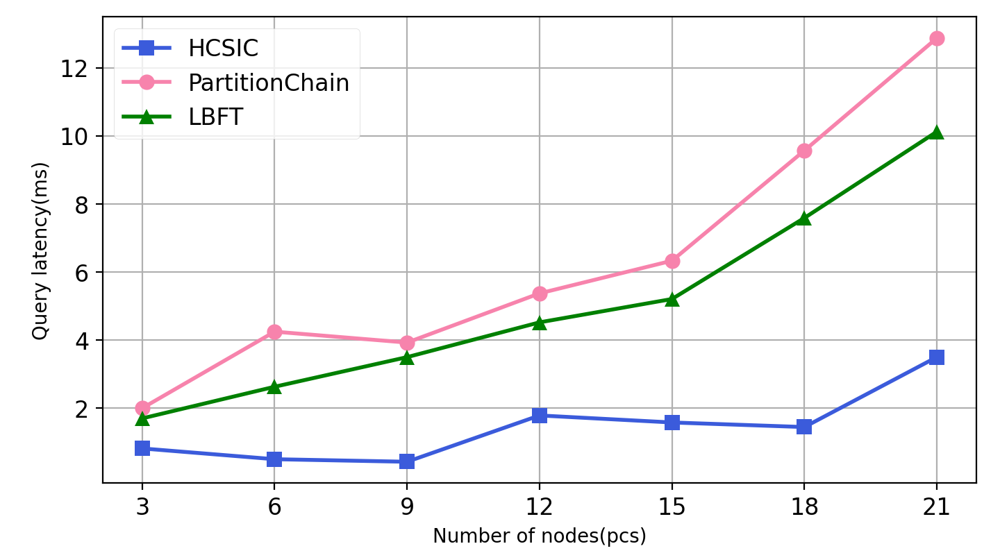
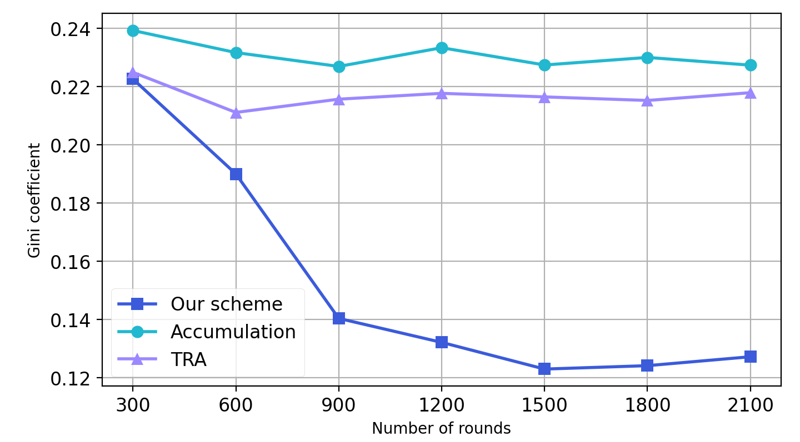

# HCSIC: Hierarchical Classified Storage and Incentive Consensus Scheme for Building IoT under Blockchain

Official code for [Hierarchical Classified Storage and Incentive Consensus Scheme for Building IoT under Blockchain](https://github.com/jjq0425/HCSIC)

Our paper: [https://doi.org/10.1016/j.jksuci.2024.102075](https://doi.org/10.1016/j.jksuci.2024.102075)

> Anonymous code repository（ https://anonymous.4open.science/r/HCSIC ) is the same as that of this code repository. Anonymous code repository is only used for double blind agreement during review and will be redirected to this warehouse in June (or earlier).

## Abstract

> With the advancements of IoT and blockchain, a novel era has emerged in the domain of smart building systems. At the same time, it also brings some problems and challenges. Most traditional solutions typically utilize the fully-replicated storage strategy that results in high storage costs, while recent solutions like coded blockchain may compromise query efficiency. Moreover, traditional reputation-based consensus schemes do not consider dynamic situations, limiting scalability. To handle these problems, we propose a novel hierarchical message aggregation scheme and a classified storage method under Reed-Solomon (RS) coding to minimize storage overhead while ensuring data recoverability and query performance. Additionally, we introduce a dynamic incentive reputation consensus mechanism to tackle scalability challenges such as preventing node monopolies, promoting new node integration, and enhancing fault tolerance. Through theoretical analysis and experimental simulation, the proposed scheme demonstrates a high degree of decentralization and scalability. Our scheme achieves a 20% reduction in the Gini coefficient compared to other approaches. Furthermore, our scheme can save 1/9 of storage overhead compared to traditional solutions while maintaining high query performance.



## Use of the Code

### Environment

#### Operating system

The program is a general-purpose Python code. In theory, it can run on any operating system equipped with **Python 3.0** (and above). 

After actual testing, the author was able to run the program on **Windows and Linux** with **Python 3.10.0**.

#### Prerequisites

In our scheme, RS encoding is an important step. You need to install the `reedsolo` library in advance

```bash
pip install reedsolo 
```

> The `reedsolo` version used by the author is 1.7.0

At the same time, in order to better present the running effect of the program. We use the `mathplot` library for result plotting. You need to install the `mathplot` and `matplotlib-inline` library.

```bash
pip install matplotlib 
pip install matplotlib-inline
```

> The `mathplot` version used by the author is 3.7.0
>
> The `matplotlib-inline` version used by the author is 0.1.6

The other Python libraries involved in the code are included as part of the Python standard library, so there is no need for additional installation.

### Project Structure

The three main **classes** of the program are defined in the following three files

* `Node.py` : Definition of System Nodes
* `Block.py` : Definition of Blocks
* `Info.py` : Simulate IoT messages

The **main code** of the program consists of the following three files

* `storage.py` : This code is an analysis of the **storage cost of the system**. We simulated the storage cost of each node from 3 to 18 nodes
* `query.py` : This code simulates the **entire process of querying**. We traverse the query for each node, take the average value, and obtain the average time it takes to find each piece of information.
* `consensus.py` : This program simulates the changes in node **reputation values.**

If you are interested in its implementation, you can refer to the relevant code files. We have provided detailed annotations.

### Start running

Simply enter the following command line to start the program. Each command line will independently start a Python instance to simulate. 

Specific functional reference project structure description.

```bash
python storage.py
python query.py
python consensus.py
```

Each command line is independent, and you can run each line separately.

## Example Demonstration (Animation slide)

In the accompanying video `ExampleDemonstration.mp4`, we present a detailed walk-through of the entire workflow using the example of "Fire Alarm and Evidence Storage." 

This case study is an exact representation of the system's operation as described in **Section 4** of the article, designed to enhance your understanding of how the system works. 

> ⚠ Note: If you are using the anonymous GitHub repository, the video may **not support online preview**. Please switch to the video file and **click the download button** in the upper right corner.

## Comparison

The traditional approach mainly uses a full storage strategy. PartitionChain proposed an RS encoding scheme, but the query efficiency is low. Our hierarchical classification storage solves these two problems, with improvements in node storage overhead and query space.





At the same time, we have constructed a new reputation value function to elect leaders more fairly, making it motivational, dynamic, and fault-tolerant. Its GINI coefficient (which measures the degree of decentralization) is relatively low.



## Acknowledgements

We gratefully thank the authors from [reedsolo](https://pypi.org/project/reedsolo/) for open-sourcing their code.

We would like to thank the reviewers for their careful reading and comments on our manuscript, in order to facilitate the better presentation of our paper.

The project is funded in part by the National Science Foundation of China (Grant No. 62071111) and the Natural Science Foundation of Xinjiang, China (Grant No. 2023D01A63).

## Cite our article

If you are interested in our project, you can cite our article.

```
@article{WU2024102075,
  title = {Hierarchical classified storage and incentive consensus scheme for building IoT under blockchain},
  journal = {Journal of King Saud University - Computer and Information Sciences},
  pages = {102075},
  year = {2024},
  issn = {1319-1578},
  doi = {https://doi.org/10.1016/j.jksuci.2024.102075},
  url = {https://www.sciencedirect.com/science/article/pii/S1319157824001642},
  author = {Xiaohua Wu and Jinqian Jiang and Xiaoyu Li and Jun Cheng and Tao Meng},
}
```

